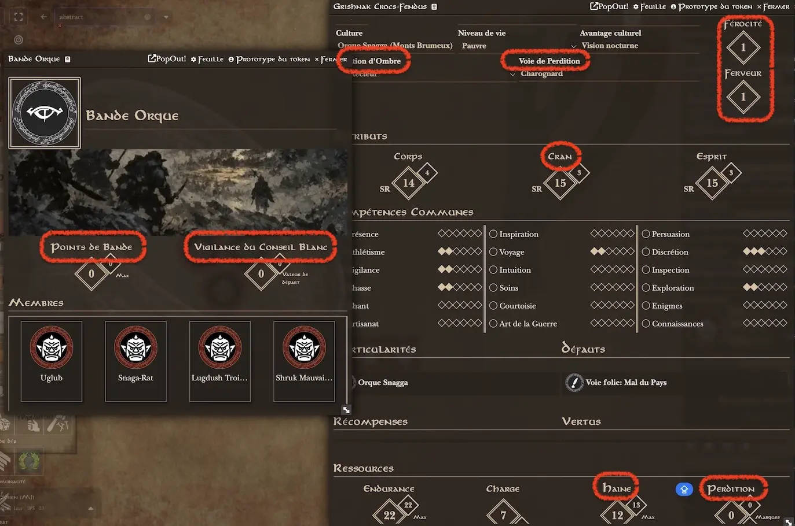

# TOR2e - Shadow Player

## English
A module for Foundry VTT and _The One Ring_ v2 game system. Overrides TOR2e translation labels for shadow-aligned player characters.

Inspired by the homebrew ruleset _In Darkness Bound_

## Français
Un module pour Foundry VTT : une extension du jeu TOR2 qui remplace les étiquettes de traduction de TOR2 pour les personnages joueurs alignés sur l'Ombre.
Inspiré des règles maison _In Darkness Bound_

## Installation
Install from FoundryVTT setup / Add-on modules / Install module with Manifest URl : https://raw.githubusercontent.com/Dispositif/tor2e-shadow-player/main/module.json

.
